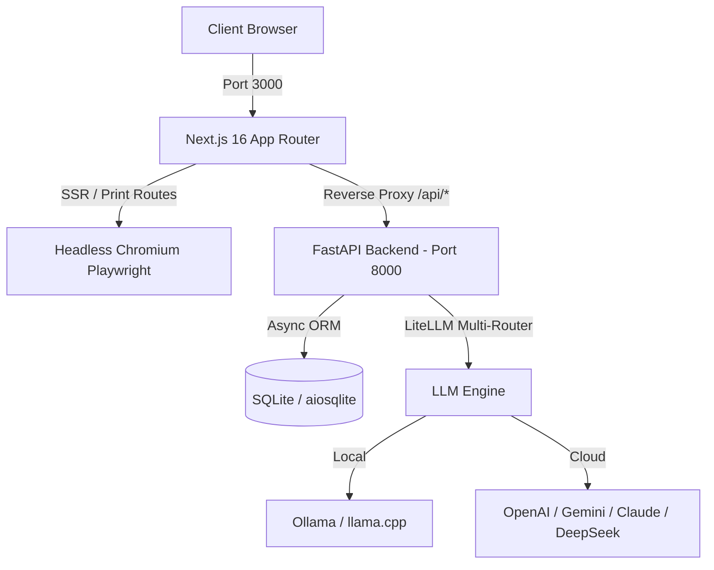

<div align="center">

# ⚡ RESUME MATCHER
### *The Intelligent AI Harness for ATS-Optimized, Tailored Resumes & Cover Letters*

<br/>

[](https://github.com/)
[](LICENSE)
[](https://nextjs.org/)
[](https://fastapi.tiangolo.com/)
[](Dockerfile)

<br/>

<!-- Social Connect Buttons -->
<p align="center">
  <a href="https://www.linkedin.com/in/aditya-ranjan-swain" target="_blank">
    
  </a>
  &nbsp;
  <a href="https://github.com/Aditya1791" target="_blank">
    
  </a>
  &nbsp;
  <a href="https://twitter.com/Monkey_D_Adi" target="_blank">
    
  </a>
  &nbsp;
  <a href="mailto:swainaditya85@gmail.com" target="_blank">
    
  </a>
</p>

<br/>


</div>

---

## 📖 Overview

**Resume Matcher** is a free, privacy-first, open-source AI platform that transforms your master resume into custom-tailored, high-impact job applications. 

By analyzing job descriptions (JDs) in real time, Resume Matcher matches hard and soft skills, generates structural diff-based improvements, and crafts matching cover letters and interview prep packages—ensuring your resume sails through **Applicant Tracking Systems (ATS)**.

### 🌟 Why Resume Matcher?

- 🎯 **Pinpoint Keyword Alignment**: Matches requirements from target job descriptions with your verified experience.
- 🛡️ **Zero Hallucinations (Diff-Based Engine)**: Employs strict AST-based diff validation to protect dates, companies, and factual achievements from AI distortion.
- 🔒 **100% Local or Cloud AI**: Seamlessly run private models via **Ollama / llama.cpp** (free & offline) or connect to **OpenAI, Anthropic Claude, Google Gemini, DeepSeek, Groq, or Azure AI**.
- 📑 **Pixel-Perfect PDF Generation**: Renders publication-grade resumes with typographic layouts (Swiss Modern, LaTeX, Minimalist, Vivid) compiled via headless Chromium.
- 📊 **Built-in Application Tracker**: Built-in Kanban workflow to organize job targets across all hiring stages.

---

## ⚡ Core Features

```
┌─────────────────────────────────────────────────────────────────────────────────┐
│                                                                                 │
│   📄 Smart Resume Parser      🎯 Diff Tailoring Engine    🖨️ PDF Template Suite │
│   Markitdown DOCX/PDF to      Preserves truthful facts;   Swiss, LaTeX, Modern, │
│   standardized JSON format    aligns keywords to JD       Clean & Vivid themes  │
│                                                                                 │
│   ✉️ Custom Cover Letters     🎙️ Interview Prep AI       📊 Kanban Job Tracker │
│   Generates personalized      Anticipates interview       Manage applications   │
│   hiring-manager letters      questions based on JD       across all pipeline   │
│                                                                                 │
└─────────────────────────────────────────────────────────────────────────────────┘
```

| Feature | Description |
|---|---|
| **Diff-Based Tailoring** | Intelligently injects missing skills and refines bullet points without rewriting your entire profile. |
| **ATS Scoring & Gap Analysis** | Real-time keyword density comparison and qualification matching matrix. |
| **Interactive Resume Wizard** | Step-by-step guided interview wizard to build or refine your resume from scratch. |
| **Rich Typography Templates** | Swiss International style, Academic LaTeX, Clean Corporate, and Creative Two-Column layouts. |
| **Multi-Lingual Support** | Native localization in English, Spanish, French, Japanese, Korean, Portuguese, and Simplified Chinese. |

---

## 🏗️ Architecture & Tech Stack



- **Frontend**: Next.js 16 (App Router), React 19, TypeScript, Tailwind CSS v4, `@dnd-kit`, TipTap Editor.
- **Backend**: Python 3.13+, FastAPI, Pydantic v2, SQLAlchemy 2.0 Async, `aiosqlite`.
- **AI Router**: LiteLLM (multi-provider AI integration with token optimization).
- **PDF Engine**: Playwright Headless Chromium with CJK & unicode font pack.
- **Security**: Cryptographic Fernet encryption at rest for user API keys.

---

## 🚀 Quick Start

### 🐳 Option 1: Docker (Fastest & Recommended)

Clone the repository and launch the unified container:

```bash
# 1. Clone repository
git clone https://github.com/Aditya1791/Tailor-RESUME.git
cd resume-matcher

# 2. Start the container
docker compose up -d
```

Open **[http://localhost:3000](http://localhost:3000)** in your browser!

---

### 💻 Option 2: Local Development

#### Prerequisites
- **Python**: `3.13+` and [uv](https://docs.astral.sh/uv/) package manager
- **Node.js**: `v22+` / `v24+` and `npm`

#### 1. Start Backend
```bash
cd apps/backend
uv sync --extra dev
uv run uvicorn app.main:app --reload --port 8000
```

#### 2. Start Frontend
```bash
cd apps/frontend
npm install
npm run dev
```

Visit **[http://localhost:3000](http://localhost:3000)**.

---

## 🧠 AI Provider Configuration

Resume Matcher supports local and remote AI models out of the box. Configure your model in the **Web Settings UI** or set environment variables:

<details>
<summary><b>Click to expand environment variable examples</b></summary>

```env
# Local AI with Ollama (100% Free & Private)
LLM_PROVIDER=ollama
LLM_MODEL=gemma3:4b
LLM_API_BASE=http://localhost:11434

# OpenAI
LLM_PROVIDER=openai
LLM_MODEL=gpt-4o-mini
LLM_API_KEY=sk-...

# Google Gemini
LLM_PROVIDER=gemini
LLM_MODEL=gemini/gemini-2.5-flash
LLM_API_KEY=AIzaSy...

# Anthropic Claude
LLM_PROVIDER=anthropic
LLM_MODEL=claude-3-5-haiku-20241022
LLM_API_KEY=sk-ant-...

# DeepSeek
LLM_PROVIDER=deepseek
LLM_MODEL=deepseek-chat
LLM_API_KEY=sk-...
```
</details>

---

## ☁️ Deployment

Deploy Resume Matcher to your favorite cloud provider in one click:

| Platform | Deployment Type | Guide |
|---|---|---|
| **Render** | Docker Web Service | Uses included [`render.yaml`](render.yaml) blueprint |
| **Railway** | Docker Container | 1-Click deploy from GitHub repository |
| **Fly.io** | MicroVM Container | `fly launch` using [`Dockerfile`](Dockerfile) |
| **Vercel + Backend** | Hybrid Deployment | Deploy `apps/frontend` to Vercel and `apps/backend` to Docker |

---

## 🤝 Contributing

Contributions are warmly welcome! Whether fixing a bug, designing a new resume template, or translating strings:

1. **Fork** the repository
2. **Create** your feature branch (`git checkout -b feature/amazing-feature`)
3. **Commit** your changes (`git commit -m 'Add amazing feature'`)
4. **Push** to the branch (`git push origin feature/amazing-feature`)
5. **Open** a Pull Request

---

## 📬 Connect & Community

<div align="center">

Questions, suggestions, or want to collaborate? Connect with us:

[](https://www.linkedin.com/in/aditya-ranjan-swain)
[](https://github.com/Aditya1791)
[](https://twitter.com/Monkey_D_Adi)
[](mailto:swainaditya85@gmail.com)

<br/>

*Built with ❤️ for job seekers worldwide.*

</div>